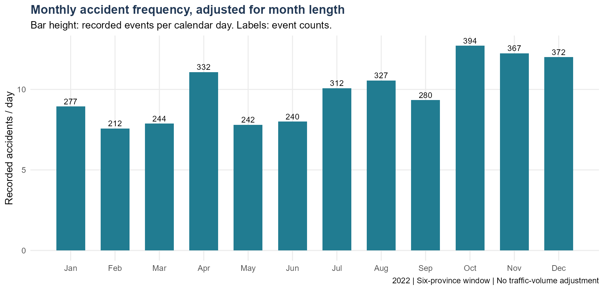
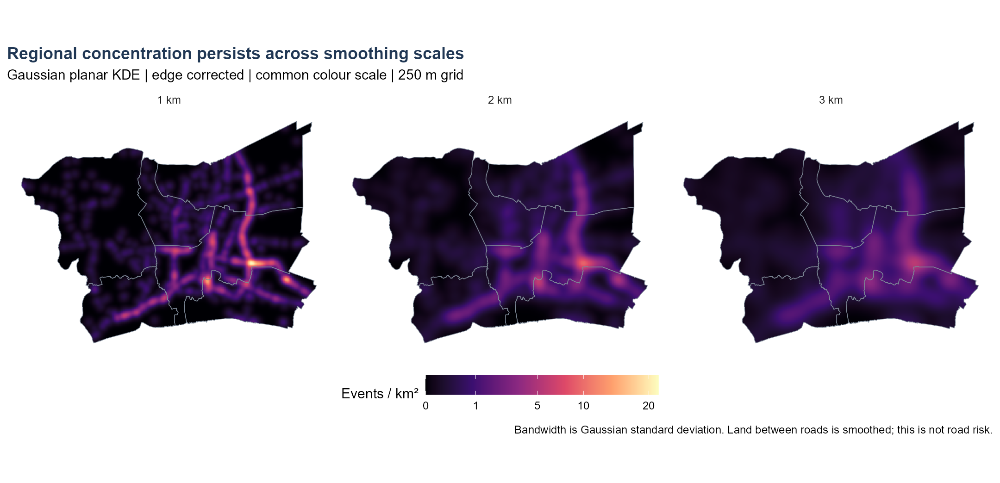
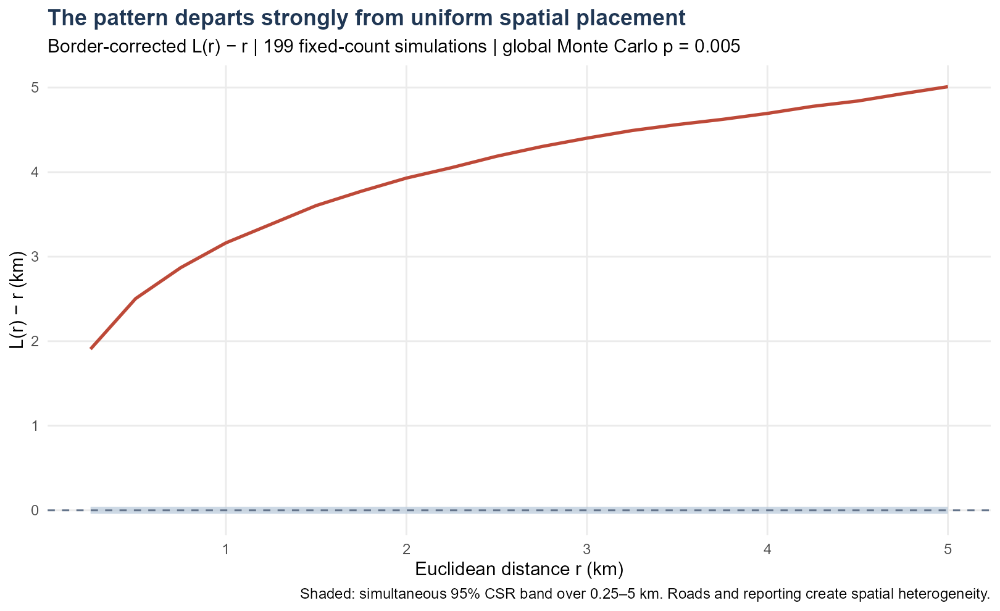
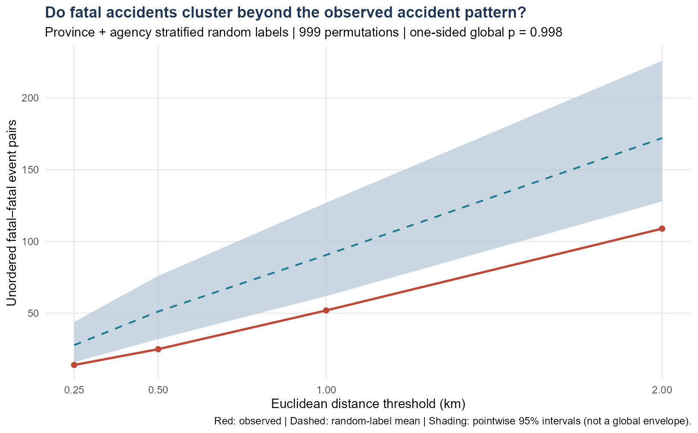

## Contents {.unnumbered}

1. Question, study area and data quality
2. Spatial and temporal concentration
3. Two second-order comparisons
4. Robustness, actions and limits

[Technical report](technical-report.qmd) · [Reproduction guide](learning-guide.qmd) · [GitHub](https://github.com/zhenhuaArhci/isss626-coursework/tree/main/take%20home%20exercise1)

## 1. Where are accidents concentrated?

**Question:** Where do recorded accidents concentrate, and are fatal accidents unusually close to one another?

::: {.columns}
::: {.column width="54%"}
### Six administrative areas

Bangkok, Nonthaburi, Pathum Thani, Samut Prakan, Samut Sakhon and Nakhon Pathom.

Incident dates: **1 January–31 December 2022**.

Window: union of six geoBoundaries polygons; **7,604 km²**.
:::
::: {.column width="46%"}
### Three measures

- **3,599** geolocated accidents
- **159** fatal accidents
- **177** recorded deaths

An accident is one record with a unique ID. Fatality counts and accident counts are different units.
:::
:::

::: {.slide-source}
Sources: [Kaggle accident dataset](https://www.kaggle.com/datasets/thaweewatboy/thailand-road-accident-2019-2022), [geoBoundaries](https://www.geoboundaries.org/api/current/gbOpen/THA/ADM1/), [NSO grouping](https://www.nso.go.th/public/e-book/Indicators-Environment/Environment-Indicators-2567/47/).
:::

## 2. Coverage shapes the findings

| Processing step | Records |
|---|---:|
| Source, all years | 81,735 |
| Incident year 2022 | 21,032 |
| Valid coordinates | 20,843 |
| Inside study polygon | **3,599** |

**189 records lack coordinates:** all are Bangkok records from the expressway agency. Their exclusion can understate mapped expressway intensity.

**3,278 distinct coordinates; 199 repeated sites.** Different accident IDs remain separate events. Province labels are checked against polygon locations.

::: {.slide-source}
No duplicate accident IDs in 2022. Inputs are checksum-verified; all preparation and analysis use R.
:::

## 3. Recorded accidents form corridors

{height=450 fig-alt="Accidents across Bangkok and five surrounding provinces, showing corridor-shaped concentrations."}

Bangkok contains **1,802 records (50.1%)**. Fatal events also occur outside the densest Bangkok alignments. Sparse areas cannot automatically be considered safer.

## 4. Late-year recorded frequency is higher

{height=405 fig-alt="Monthly events per day with October highest and February lowest."}

**October: 12.71/day; February: 7.57/day.** October–December account for **31.5%** of records. Calendar-day adjustment removes month-length differences; traffic exposure and reporting changes remain uncontrolled.

## 5. Broad concentrations survive smoothing

{height=390 fig-alt="Planar kernel density maps at 1, 2 and 3 kilometre Gaussian bandwidths."}

Gaussian KDE, **250 m grid**, polygon edge correction, events/km². Adjacent-bandwidth rank correlations are **0.901** and **0.963**; top-decile overlap is **0.644** and **0.731**. Local hotspot boundaries remain bandwidth-sensitive.

## 6. Uniform spatial placement is inadequate

{height=400 fig-alt="Observed L minus r lies above the simultaneous CSR simulation band."}

Border-corrected **L(r) − r**, 0.25–5 km; **199 fixed-count simulations**, global **p = 0.005**. This establishes departure from the uniform-land benchmark. Roads and reporting intensity can explain that departure; it is not evidence of crash contagion.

## 7. Fatal events show no excess proximity

{height=395 fig-alt="Observed fatal-fatal pairs are below the stratified random-label mean at four distance thresholds."}

**999 permutations** preserve province × agency fatal totals and all accident locations. At 1 km: **52 observed pairs vs 90.6 expected**. One-sided global **p = 0.998**: no excess clustering at the tested scales. This does not prove random labelling or dispersion.

## 8. Main conclusions survive the checks

| Sensitivity check | Result |
|---|---|
| CSR with one point per recorded location | p = **0.005** |
| Fatal-label test without coincident pairs | p = **0.998** |
| Fatal-label test without strata | p = **0.995** |
| KDE: 1, 2 and 3 km bandwidths | Broad concentration persists |

**Interpretation:** high accident intensity and excess fatal-event clustering are different questions. Stable broad patterns do not make individual hotspot boundaries or causal explanations certain.

## 9. Use the evidence for screening and review

1. **Review broad corridors** that remain concentrated across bandwidths; confirm exact sites using road geometry and original reports.
2. **Review fatal cases separately**, including dispersed locations beyond the highest-density zones.
3. **Recover missing expressway coordinates** before comparing geographic performance.
4. **Check late-year workload** against exposure, operating conditions and additional years.

Before selecting an intervention, obtain traffic volumes, road design, speed and road-user data. Evaluate changes with suitable comparison sites.

## 10. What this study establishes

**Supported:** concentration of *recorded* accidents, unequal monthly frequency, departure from uniform spatial placement, and no evidence of extra fatal-event clustering under the specified conditional test.

**Limits:** selective reporting; 189 missing coordinates; uncertain positional accuracy; 2017 boundary vintage; one year; Euclidean distances; no traffic exposure.

Planar intensity is a regional screening measure. A validated historical road graph is needed for network density and road-segment inference.

::: {.slide-source}
Methods: [spatstat](https://spatstat.org/), [Chapter 7](https://r4gdsa.netlify.app/chap07), [spNetwork reference](https://jeremygelb.github.io/spNetwork/reference/index.html). Full assumptions, code, source attribution and results: [technical report](technical-report.qmd).
:::
