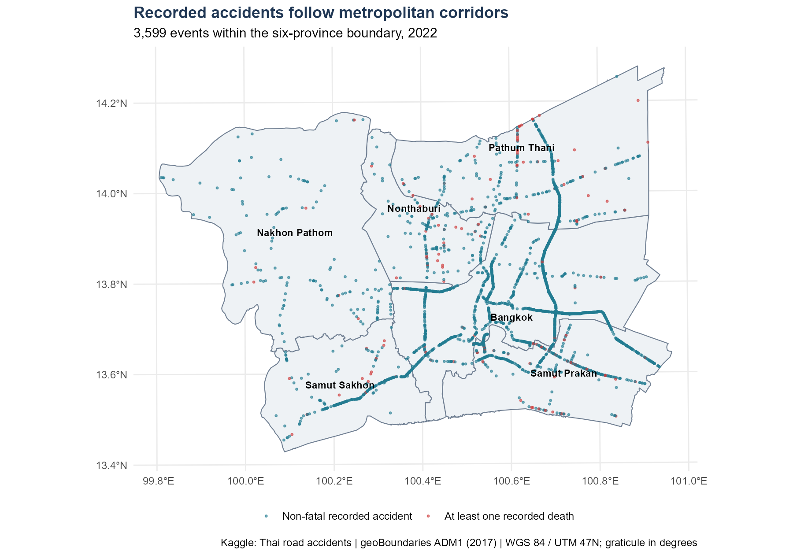

## Where accidents concentrate—and what the pattern means

This study examines **3,599 recorded accidents** across Bangkok and five surrounding provinces in 2022. It combines a documented data-quality audit, spatial density estimation, temporal summaries and simulation-based second-order analysis.

::: {.th-links}
[Read the technical report](technical-report.qmd)
[View the executive summary](executive-summary.qmd)
[Explore the R source on GitHub](https://github.com/zhenhuaArhci/isss626-coursework/tree/main/take%20home%20exercise1)
:::

{fig-alt="Recorded accidents in the six-province Greater Bangkok study window, highlighting fatal events."}

## Main findings

- **Accident records form metropolitan corridors.** Broad density concentrations persist across 1–3 km smoothing scales, while local hotspot boundaries change.
- **Recorded frequency varies during the year.** October has 12.71 events per day; February has 7.57. These figures do not adjust for traffic exposure.
- **Fatal-event geography needs separate attention.** There are 159 fatal accidents and 177 recorded deaths. A conditional permutation test finds no excess fatal-event proximity at the investigated distances.
- **Coverage limits comparison.** All 189 records without coordinates belong to Bangkok's expressway reporting agency. They cannot be represented on the maps without recovering their locations.

The maps support regional screening and case review. They do not measure accident risk per journey or establish the causes of accidents.

## Study materials

| Material | Contents |
|---|---|
| [Technical report](technical-report.qmd) | Study design, source audit, executable R code, five figures, statistical tests, sensitivity analysis and planning implications |
| [Executive summary](executive-summary.qmd) | Ten content slides, plus cover and contents |
| [Reproduction guide](learning-guide.qmd) | RStudio setup, acquisition, execution order, file structure and output checks |
| [GitHub exercise folder](https://github.com/zhenhuaArhci/isss626-coursework/tree/main/take%20home%20exercise1) | Quarto sources, R scripts, figures and input metadata |

**Sources:** [Kaggle accident records](https://www.kaggle.com/datasets/thaweewatboy/thailand-road-accident-2019-2022), [geoBoundaries administrative polygons](https://www.geoboundaries.org/api/current/gbOpen/THA/ADM1/), and the [NSO Bangkok and Vicinities grouping](https://www.nso.go.th/public/e-book/Indicators-Environment/Environment-Indicators-2567/47/). The report follows the Thailand option of the [assignment brief](https://isss626-ay2026-27aug.netlify.app/take-home_ex01).
